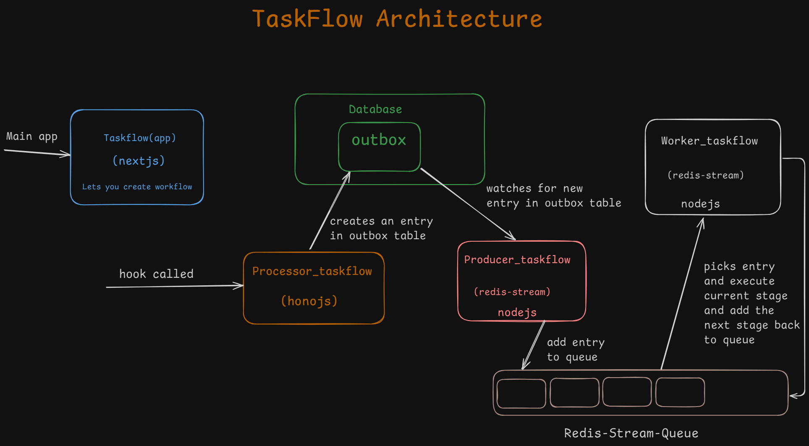

# TaskFlow 

**TaskFlow** is a powerful **automation** platform designed to help users streamline their workflows. It allows users to create custom workflows that respond to specific triggers, making it easier to automate repetitive tasks and save time. 

## Technologies Used

## Features

- **Webhook Trigger**: Users can create workflows that are triggered by webhooks. This allows external services or applications to initiate workflows within TaskFlow when certain events occur.

- **Email Action**: Once triggered, TaskFlow can perform a variety of actions, including sending automated emails. This is useful for sending notifications, confirmations, or any kind of automated response.

- **Redis Stream for Sequential Execution**: TaskFlow ensures that actions within a workflow are executed in the correct sequence by leveraging Redis Streams. This guarantees that each action is performed one after the other, maintaining the integrity of the workflow.

## How It Works

1. **Create a Workflow**: Users can define workflows that consist of a webhook trigger and one or more actions, such as sending an email.
  
2. **Webhook Trigger Activation**: When the webhook is called, TaskFlow captures the event and begins executing the associated actions.

3. **Sequential Execution**: Each action is processed sequentially through Redis Streams, ensuring that actions are completed in the intended order.

## Use Cases

- Automate email notifications based on webhook events.
- Build workflows that respond to real-time data from external services.
- Ensure tasks are executed in the correct order, such as approval flows or multi-step processes.

TaskFlow simplifies complex workflows, making automation accessible to everyone, while ensuring reliable and orderly execution of each task.

## Architecture

- **task-flow(app)**: It is a nextjs app that lets you create workflows and manage it, it provides you webhook trigger link.

- **processor_task-flow**: It is a honojs app that that triggers when webhook called, it creates an entry in workflowOutBox table in database with the workflowId in it.

- **producer_task-flow**: It is a nodejs app which continuously watches workflowOutBox table in database, if there is any entry it picks it and put it to redis-stream queue and deletes the entry in database.

- **worker_task-flow**: It is also a nodejs app that continuosly watches the redis queue and if there is any entry present it picks it and do the current stage action and if it has follow-up stage it adds the next stage to redis queue.